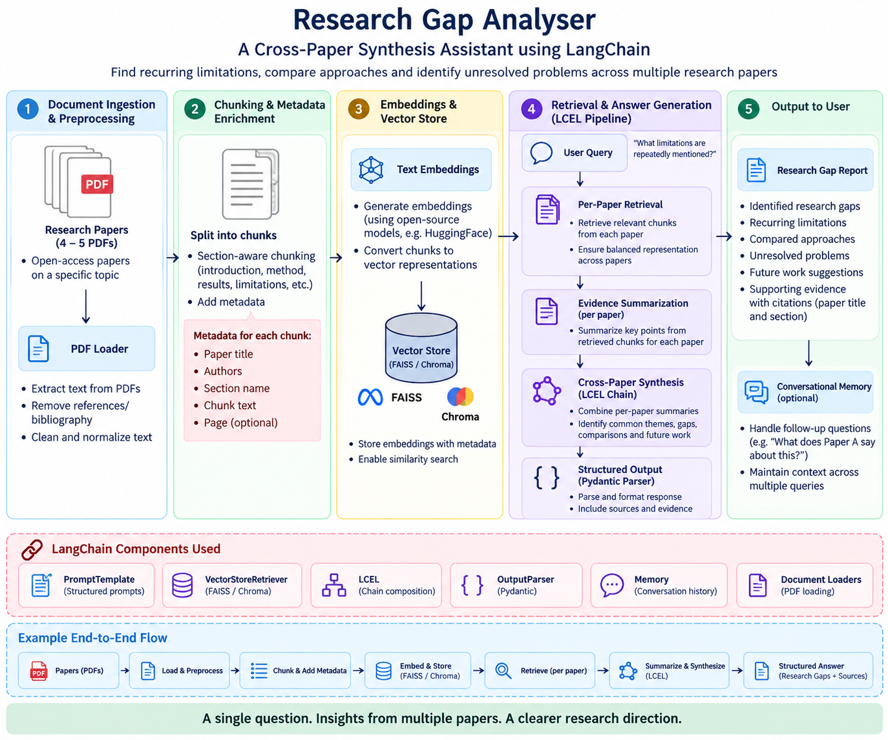

# Research Gap Analyzer

A notebook that reads a small pile of research PDFs, lets you ask questions about them, and answers **only using what's actually written in the papers** — with a page number attached to every claim, so you can check it isn't making things up.

It works two ways:
- **Ask about one paper** ("What limitations does this paper mention?")
- **Ask across all the papers at once** ("What limitations do they all share?") and get back a synthesis, or a structured list of "gaps" with evidence for each one.

Everything runs free, in Google Colab: local embeddings (no API key needed for that part) + Google Gemini's free tier for the actual reasoning.

## Architecture

```

Research Papers
      │
      ▼
PDF Text Extraction
      │
      ▼
Section-aware Chunking
      │
      ▼
Metadata Tagging
      │
      ▼
Sentence Embeddings
      │
      ▼
FAISS Vector Store
      │
      ▼
Hybrid Retrieval (FAISS + BM25)
      │
      ▼
Per-Paper Evidence
      │
      ▼
Gemini LLM
      │
      ├──────────────┐
      ▼              ▼
Single-Paper    Cross-Paper
Analysis        Synthesis
                     │
                     ▼
            Structured Research
                Gap Output
```



---

## 1. What it actually does, step by step

| Step | What happens |
|---|---|
| 1. Parse PDFs | Extracts text from each paper, handling two-column layouts correctly, stripping headers/footers/watermarks, keeping `[[PAGE n]]` markers so every sentence still knows what page it came from. |
| 2. Chunk + tag | Splits each paper into ~1000-character chunks without cutting across section boundaries. Every chunk is tagged with which paper, which section (abstract/methods/results/etc.), and which page it came from. |
| 3. Embed + index | Turns every chunk into a vector (using a free local model) and builds a FAISS search index so you can search by meaning, not just keywords. |
| 4. Per-paper retrieval | When you ask a question, it searches **the whole paper**, one paper at a time — so a big paper can't drown out a small one, and an answer hiding in "Methods" or a table isn't invisible just because your question sounds like it belongs in "Discussion." |
| 5. Connect to Gemini | Picks whichever free Gemini model is actually working right now (the free tier changes availability often). |
| 6. Safety helpers | Retries automatically on rate limits, and checks after every answer that any page number it cited was genuinely among the retrieved text (a "grounding check"). |
| 7. Single-paper Q&A | Ask a question about one paper, get an answer with page citations. |
| 8. Cross-paper synthesis | Asks the same question of every paper separately (map step), then merges those into one combined answer that notes where papers agree or disagree (reduce step). |
| 9. Structured gap extraction | Same idea as step 8, but instead of a paragraph you get a clean list: each gap, which papers mention it, and the exact quote/page from each. This is the main deliverable. |
| 10. Memory | Lets you ask a follow-up like "which of those is easiest to fix?" and have "those" resolved correctly. |
| 11. Formal evaluation | Runs a fixed set of test questions (including two designed to be hard) and saves the results, so the whole thing is testable and repeatable, not just a demo. |

**The one important design decision to know about:** earlier versions of this notebook only searched inside sections like "Discussion" or "Conclusion" when looking for limitations. That's a trap — a limitation can live anywhere (a caveat buried in Methods, a number in a results table). The fixed version searches the whole paper by meaning and keeps "section" only as a label for the citation, not a filter. This is why two of the test questions below exist — they were specifically chosen because the old, section-gated version got them wrong.

---

## 2. Setup

Run the notebook top to bottom in Google Colab (each numbered cell installs what it needs):

1. Upload your PDFs when prompted in Step 1, or drop them into a `papers/` folder first.
2. Add a Gemini API key as a Colab secret named `Gemini_API` (Settings → Secrets in Colab) before Step 5.
3. Run every cell in order once. After that, the functions below are ready to call from any later cell.

---

## 3. How to manually test a single paper

Use `per_paper_retrieve` + `single_paper_chain`, or just copy the pattern from Step 7's test cell:

```python
paper = "Saha2024 (Fuzzy logic depression level)"   # must match a label in PAPERS (Step 2 cell)
question = "What limitations or shortcomings does this paper mention?"

hits = per_paper_retrieve(question, k=3, papers=[paper])[paper]
context = "\n\n".join(f"(p{h.metadata['page']}) {h.page_content}" for h in hits)
answer = safe_invoke(single_paper_chain, {"paper": paper, "context": context, "question": question})

print(answer)
check_grounding(answer, hits)   # confirms every page it cited was actually retrieved
```

**To try a different question or paper:** just change `paper` and `question` — everything else stays the same. Paper labels are listed by running `PAPER_LABELS` (built in Step 4's cell) or looking at the `PAPERS` dictionary in Step 2.

**To ask a follow-up that remembers context**, use `ask_with_memory` instead (Step 10):

```python
ask_with_memory(paper, "What limitations does this paper mention?")
ask_with_memory(paper, "Of those, which seems easiest to fix?")   # "those" resolves correctly
```

---

## 4. How to manually test across the combined pool of papers

**A) Free-text synthesis** — one paragraph comparing all papers on a question:

```python
final, hits = cross_paper_synthesize("What limitations are repeatedly mentioned across the papers?")
```
This prints the per-paper evidence (map step), then the combined synthesis (reduce step), then runs the grounding check automatically. Costs 6 Gemini calls (5 papers + 1 merge) — run it deliberately, not in a loop.

**B) Structured gap list** — the actual required deliverable, returns clean data instead of prose:

```python
result, hits = analyze_gap("What limitations are repeatedly mentioned?")

for g in result.gaps:
    print(g.gap)
    print(g.papers)
    for e in g.evidence:
        print(f"  [{e.paper} p{e.page}] {e.quote_or_paraphrase}")
```
`result` is a Pydantic object (`ResearchGapList`), so you can also do `result.dict()` or `result.json()` if you want it as raw data for a report or slide.

**To test your own question**, just swap the string:
```python
analyze_gap("What future work do the authors propose, and where do their proposals overlap?")
```

**Optional narrowing (usually leave these alone):**
- `sections=["discussion", "conclusion"]` — restricts the search to specific sections. Only use this if you already know where the answer lives and want to save API calls; the default (`None`) searches the whole paper and is what actually works correctly.
- `exclude_table_like=True` — drops chunks that look like flattened comparison tables. Turn this **off** (`False`) if your question's answer might genuinely be a number sitting in a table (e.g. "what accuracy did each paper report?").

---

## 5. The formal evaluation (Step 11)

A fixed set of 6 test questions runs automatically and saves progressively to `eval/results.json`, so a rate-limit error partway through doesn't lose earlier answers — just rerun the same cell and it picks up where it left off.

| Key | Question | Why it's included |
|---|---|---|
| `gap_limitations` | What limitations are repeatedly mentioned across the papers? | Core synthesis case |
| `gap_comparisons` | Which approaches or methods are compared across the papers? | Core synthesis case |
| `gap_unresolved` | What problems remain unresolved across the papers? | Core synthesis case |
| `gap_future_work` | What future work do the authors propose across the papers? | Core synthesis case |
| `conflict_accuracy` | Which paper reports the highest accuracy? | Deliberately tricky — the answer is a number buried in a results table, not a written-out sentence |
| `failure_pca_count` | How many papers use PCA? | Deliberately tricky — the answer lives in Methods, not Discussion, which is exactly what the old section-gated retrieval used to miss |

The last two questions are the ones that should be used to demonstrate the retrieval fix from Step 4/8: with the fix, they should now find the right numbers; without it (the old hardcoded `sections=["discussion","conclusion","results"]` behavior), they used to fail silently.

---

## 6. Known, honest limitations

- **Memory only helps the answer, not the search.** A follow-up like "which of those is easiest to fix?" gets its pronouns resolved for the purpose of writing the answer, but the retrieval step still searches using the literal follow-up text — it doesn't know what "those" refers to. A proper fix would add a "condense question" step before retrieval; that's flagged here, not built.
- **Section labels are tuned to this paper set.** The heading vocabulary (abstract/methods/discussion/etc.) assumes IMRaD-structured academic papers. It's fine because it's used only as a citation label, never as a retrieval filter — but it wouldn't recognize headings in, say, a legal contract or financial filing.
- **The free Gemini tier is volatile.** Model availability and quotas change; the notebook auto-falls-back across a candidate list, but if every candidate is exhausted for the day, you have to wait for the quota reset — retries won't help with that.
- **Gap merging is a judgment call by the model.** The system prompt asks it to only merge two papers' limitations into one "gap" if they share the same underlying cause, not just the same downstream consequence. If it over- or under-merges on a given question, that's a real finding about instruction-following at this level of nuance, not a bug.

---

## 7. Saving your work

The last two cells zip up everything you'd need to resume later (papers, extracted text, FAISS index, chunks, eval results) and download it, with a matching cell to unzip it back into a fresh Colab session.
