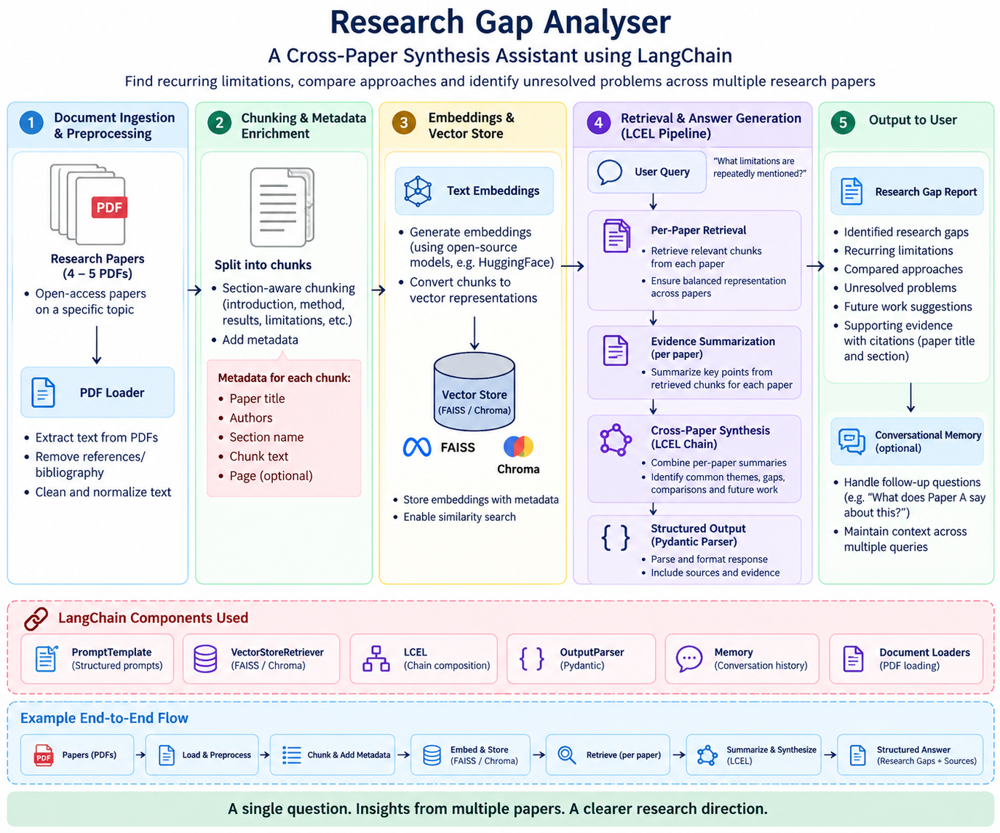

# Research Gap Analyzer

**An AI research assistant that only answers from your papers, and shows you the page number for every claim.**

You give it a few research PDFs. You ask a question. It answers using only what is written in those papers, and every statement comes with a page number so you can open the PDF and check it.

Built with LangChain for Lab 9, Activity 1 (Academic Research Assistant).
**Team and roles:** *(fill in names and contributions)*

---

## 1. The problem in plain words

If you read 5 papers on the same topic and want to know *"what is still unsolved?"*, you have to re-read all five and keep notes. A normal chatbot can't be trusted here, because it may answer from memory and make things up.

This tool reads the papers for you, but it is **not allowed to say anything that isn't in them**, and it has to **cite the page**. That is what RAG (Retrieval-Augmented Generation) means: first *retrieve* the relevant text, then let the AI *generate* an answer from only that text.

It can do three things:

| Mode | You ask | You get |
|---|---|---|
| **One paper** | "What limitations does the Saha paper mention?" | A short answer with page numbers |
| **All papers** | "What limitations are repeated across the papers?" | One combined answer saying where papers agree or differ |
| **Structured gaps** | Same question | A clean list: each gap, which papers have it, and the evidence with page numbers (main deliverable) |

**Our papers:** 5 open-access papers on depression detection using fuzzy logic, neuro-fuzzy systems and machine learning (Adegboye2021, Khan2024, Chattopadhyay2017, Zulfiker2021, Saha2024). Together they become 270 searchable chunks.

---

## 2. See it work (real output from our notebook)

**Question asked:** *"What limitations are repeatedly mentioned across the papers?"*

**What the tool returned** (3 of the 8 gaps it found):

```
GAP: Both studies use small, demographically narrow samples, limiting generalizability.
  Papers: ['Adegboye2021', 'Saha2024']
  - [Adegboye2021 p7] The system was evaluated on a relatively small test set (40 cases).
  - [Saha2024 p16]    The sample is limited in size and demographic breadth; a more varied
                      sample representing many populations would improve generalizability.

GAP: EEG data collection is restricted to frontal-lobe electrodes, introducing spatial bias.
  Papers: ['Khan2024']
  - [Khan2024 p24]    The study selected only frontal-lobe electrodes to keep the sensor count
                      low, which introduces a certain degree of bias toward the frontal lobe.

GAP: Data were collected via email or social media from voluntary participants,
     creating a self-selection bias.
  Papers: ['Saha2024']
  - [Saha2024 p7]     Data were collected via email or social media from voluntary participants...
```

**How to read this:** each gap says *which papers* have it, and each piece of evidence says *which paper and which page*. You can open Saha2024 page 16 and check the sentence. The full output is saved in `eval/structured_gaps_sample.json`.

**One more example** (single paper, same kind of answer, paste your own output here after running the demo cell in Section 4):

```
(paste the output of:  ask("What limitations does this paper mention?", paper="Saha")  )
```

---

## 3. How it works (5 steps, no jargon)

Think of a librarian who finds the right pages, hands only those pages to a writer, and makes the writer cite them.

```
  PDFs
   │  1. READ        Extract the text, keep track of page numbers
   ▼
  Chunks
   │  2. CUT         Split each paper into ~1000-character pieces (chunks).
   │                 Each chunk remembers: which paper, which section, which page
   ▼
  Search index
   │  3. INDEX       Turn every chunk into numbers (an "embedding") so we can
   │                 search by meaning. Stored in FAISS.
   ▼
  Relevant chunks
   │  4. FIND        For your question, pick the best chunks FROM EACH PAPER
   │                 (by meaning + by keywords)
   ▼
  LLM (Groq / Gemini)
   │  5. ANSWER      The AI gets ONLY those chunks and must cite pages
   ▼
  Answer with page numbers
```



> `Architecture_Phase1.png` must sit in the same folder as this README, or the image shows as broken.

### Why each choice was made

| Choice | Why |
|---|---|
| **Chunks of ~1000 characters** | Small enough to be specific, big enough to keep a full idea. 150 characters overlap so ideas aren't cut in half. |
| **Never cross a section boundary** | A chunk is either Methods or Results, never a mix, so the section label is correct. |
| **Metadata (paper, section, page)** | This is what makes page citations possible. |
| **Two kinds of search (FAISS + BM25)** | FAISS finds chunks that *mean* the same thing ("shortcoming" = "limitation"). BM25 finds exact words ("PCA"). Each is weak where the other is strong, so we combine them (Reciprocal Rank Fusion). |
| **Search each paper separately** | A long paper (74 chunks) cannot drown out a short one (20 chunks). Every paper gets a voice. |
| **No section filter** | See Section 5: this was our biggest lesson. |
| **Map-reduce for all papers** | *Map:* summarise each paper on its own (5 AI calls). *Reduce:* merge the 5 summaries (1 call). This keeps each paper's evidence separate until the end. |
| **Pydantic structured output** | Forces the AI to return data (gap, papers, evidence) instead of a loose paragraph, so it is clean and checkable. |
| **Groq `gpt-oss-120b`, Gemini as fallback** | Both have free tiers. Gemini's quota ran out mid-evaluation, so the final results used Groq. |

### LangChain components used

| Component | Used for |
|---|---|
| `RecursiveCharacterTextSplitter`, `Document` | Chunking with metadata |
| `HuggingFaceEmbeddings`, `FAISS` | Vector store |
| `BaseRetriever` (our own hybrid retriever) | Per-paper search |
| `ChatPromptTemplate`, LCEL chains (`prompt \| llm \| parser`), `StrOutputParser` | Single-paper and cross-paper answers |
| `PydanticOutputParser` | Structured gap list |
| `RunnableWithMessageHistory`, `MessagesPlaceholder` | Memory for follow-up questions |

### What each notebook step does

| Step | What happens |
|---|---|
| 0. Setup | Installs packages, sets run switches (`RUN_EVAL`, `PROVIDER_ORDER`), defines paths. |
| 1. Parse PDFs | Extracts text page by page, handles two-column layouts, strips headers, footers and watermarks, keeps `[[PAGE n]]` markers. |
| 2. Chunk + tag | ~1000-character chunks that never cross a section boundary. Each chunk is tagged with paper, section and page. |
| 3. Embed + index | Local `all-MiniLM-L6-v2` embeddings and a FAISS index (270 chunks). |
| 4. Per-paper hybrid retrieval | For each paper separately, ranks every chunk by meaning (FAISS) and by keywords (BM25), then fuses the two rankings with Reciprocal Rank Fusion. Sections are only a citation label, never a filter. |
| 5. Connect the LLM | Tries Groq first (`gpt-oss-120b`, then smaller fallbacks), then Gemini, using the first model that answers a test call. |
| 6. Helpers | `safe_invoke` (caching, retry with backoff, stops on a daily quota error) and `check_grounding` (page-number check). |
| 7. Single-paper Q&A | Retrieve, build a page-tagged context, answer with page citations. |
| 8. Cross-paper synthesis | Map: summarise each paper's evidence (5 calls). Reduce: merge into one answer (1 call). |
| 9. Structured output | `analyze_gap()` returns a Pydantic `ResearchGapList`. The main deliverable. |
| 10. Memory | `RunnableWithMessageHistory` so a follow-up like "Of those, which is easiest to fix?" resolves "those". |
| 11. Evaluation | Six fixed questions, a v1 vs v2 scorecard, and a quote-level grounding check. |
| 12. Backup | Zips the whole workspace so a fresh Colab session can resume. |
| Appendix A | Optional stricter-prompt experiment (v3). Not part of the reported results. |

**The key design decision:** early versions only searched "Discussion" or "Conclusion" sections for limitations. That is a trap, because a limitation can sit in Methods (a caveat) or in a results table. The fixed version searches the whole paper by meaning and keeps "section" only as a label. (Proof in Section 5.)

---

## 4. Try it with ANY question (live demo)

**Step A. Get the notebook ready.** Run the notebook cells from **Step 0 down to Step 8** (one after another, not "Run all"). This loads everything and makes no expensive calls. If you are in a fresh Colab session, restore from the backup first (see Section 7).

**Step B. Paste this helper into a new cell and run it once.** It lets you ask any question in one line:

```python
def ask(question, paper=None, k=3):
    """Ask ANY question. paper=None -> all 5 papers. paper='Saha' -> just that paper (name part is enough)."""
    if paper:
        label = next((p for p in PAPER_LABELS if paper.lower() in p.lower()), None)
        if label is None:
            print("No such paper. Choose from:", PAPER_LABELS); return
        hits = per_paper_retrieve(question, k=k, papers=[label])[label]
        context = "\n\n".join(f"(p{h.metadata['page']}) {h.page_content}" for h in hits)
        answer = safe_invoke(single_paper_chain, {"paper": label, "context": context, "question": question})
        print(f"\nQ: {question}\nPAPER: {label}\n\nANSWER:\n{answer}\n")
        check_grounding(answer, hits)
    else:
        answer, hits = cross_paper_synthesize(question, k=k)
    print("\nSOURCES THE AI WAS ALLOWED TO USE:")
    for h in hits:
        m = h.metadata
        print(f"  [{m['paper']} | {m['section']} | p{m['page']}] {h.page_content[:90]}...")
    return answer
```

**Step C. Ask anything:**

```python
ask("What datasets do the papers use?")                                   # all 5 papers (6 AI calls)
ask("What accuracy did this paper achieve?", paper="Khan")                # one paper (1 AI call)
ask("Which papers use fuzzy logic and how?")
ask("What future work do the authors suggest?", paper="Zulfiker")
```

**What you will see:** the answer with page numbers, then a **grounding check** line (did it only cite pages it was actually given?), then the exact **sources** (paper, section, page) it was allowed to use. That last part is your proof that nothing came from outside the papers.

**If the AI says it can't find something**, that is correct behaviour, not a bug: it is told to say so instead of guessing.

---

## 5. Proof that it works, and proof of what we fixed

### The biggest lesson: v1 vs v2

Our **first version (v1)** only searched certain sections (Discussion, Conclusion, Results) when looking for limitations. That sounds smart, but it is a trap: a limitation can be hidden anywhere, for example in Methods or in a table.

Our **fixed version (v2)** searches the whole paper by meaning and keywords, and uses "section" only as a label on the citation.

We ran the same 6 questions on both and saved the results (`eval/results_v1.json`, `eval/results_v2_groq.json`). Since v1 ran on Gemini and v2 on Groq, the two runs also differ in model, not only in retrieval.

| Question | v1 (old) | v2 (fixed) |
|---|---|---|
| What limitations are repeated? | short answer, 0 page citations | 8 citations across 5 pages |
| Which methods are compared? | 1 citation | 15 citations across 9 pages |
| What problems remain unresolved? | 2 citations | 12 citations across 6 pages |
| What future work is proposed? | 3 citations | 8 citations across 4 pages |
| Which paper has the highest accuracy? | named no paper, gave no figure | named all 5 papers, cited figures |
| How many papers use PCA? | **0** | **2** |

The "no relevant evidence found" answers dropped from 13 to 0 in total.

> These numbers show that the system **answers**. They do not prove the answers are **correct**. The next part shows the checking.

### The clearest proof: "How many papers use PCA?"

| | Answer |
|---|---|
| **v1** | "None of the papers mention PCA ... 0 papers." |
| **v2** | "2 papers use PCA." Chattopadhyay2017 applied PCA (p4) with seven principal components (p5 to p6). Saha2024 is also listed (p4). Zulfiker2021 is correctly excluded, because PCA appears there only as a benchmark (p2). |

The fix works: v1 missed Chattopadhyay's real use of PCA and v2 found it with page numbers. **But v2 is not perfectly right.** The Saha2024 line was quoted as *"as a dimensionality reduction method, **they** also employ PCA"*, which sounds like the authors describing *other people's* work. So "2" is probably one too many. We kept this as a finding instead of hiding it.

### How we checked that answers are grounded

| Check | What it tests | What it can't catch |
|---|---|---|
| **Page check** (`check_grounding`) | Every page the answer cites was actually among the pages given to the AI | A correct page with the wrong claim |
| **Quote check** (`verify_quotes`, Step 11.4) | Every quoted phrase really appears in that paper's retrieved text | A real quote taken from the paper's related-work section |
| **Reading it ourselves** | Compare the answer to the PDF | (slow, but it caught the Saha error above) |

Conclusion: the answers are **grounded in the source text** (nothing invented), but **not always correctly attributed** (a sentence about another study can be credited to the paper that cites it).

---

## 6. Where it fails, and what we would do next

| Problem | What happens | Fix we would try |
|---|---|---|
| **Related-work leakage** | Text where a paper describes *other* studies can be retrieved and credited to that paper (causes the PCA overcount and some accuracy figures) | Down-weight `related_work` chunks for questions about a paper's *own* methods or results |
| **Shallow grounding check** | Page check only confirms the page exists, not that the claim belongs to that paper | Also check which section a quote came from |
| **Chunks can start mid-sentence** | One garbled claim in our results | Split on sentence boundaries |
| **Memory helps the answer, not the search** | In "which of those is easiest to fix?", the search still uses the literal words "those" | Add a step that rewrites the follow-up into a full question before searching |
| **Free-tier limits** | Quotas change; if all are used up for the day, you must wait | Fallback list of models and providers (built), paid tier for real use |
| **Only 5 papers** | Enough to show the method, not to claim general results | Test on more papers |
| **Gap merging is a model judgement** | It may merge or split gaps differently on another run | Strict merge rule in the prompt (built); human review |

---

## 7. Run it yourself

**Files in this submission**

| File | What it is |
|---|---|
| `GAI_ResearchGapAnalyzer_clean.ipynb` | The notebook (Steps 0 to 12) |
| `Architecture_Phase1.png` | Architecture diagram |
| `eval/results_v1.json` | Old pipeline answers (evidence of the problem) |
| `eval/results_v2_groq.json` | Fixed pipeline answers (evidence of the fix) |
| `eval/structured_gaps_sample.json` | Sample structured output |

**Setup in Google Colab**

1. Add Colab secrets (key icon, enable notebook access): `Groq_API` (main LLM) and optionally `Gemini_API` (fallback). At least one is needed. Embeddings and search are local and need no key.
2. Run Step 0 to Step 8 in order. Step 1 asks you to upload the 5 PDFs.
3. Use the `ask()` helper from Section 4.

**Fresh Colab session?** Upload `ResearchGapAnalyzer_backup_v2.zip`, run Step 0, run the "Option B" restore cell, skip Steps 1 and 2, then continue from Step 3.

**Do not press "Run all" repeatedly.** The formal evaluation is switched off (`RUN_EVAL = False`) so it cannot use up the free quota. The saved files in `eval/` are our test evidence. To re-run it, set `RUN_EVAL = True`; it is resumable (about 36 AI calls).

The step-by-step table in Section 3 is the notebook map.

---
 
## 8. Restore from the backup (fresh Colab session)
 
Don't use "Run all". Upload `ResearchGapAnalyzer_backup_v2.zip` to `/content`, then run these cells in order:
 
1. **Step 0** (both cells). Keep `RUN_EVAL = False`.
2. **Option B** (restores the saved files). By hand: `!unzip -o /content/ResearchGapAnalyzer_backup_v2.zip -d /`
3. **Step 3** (embeddings + FAISS), then **Step 4** (4.1, 4.2, 4.3).
4. **Step 5** (connect the LLM), then **Step 6** (helpers).
5. **Step 7** (only if you want single-paper questions), then **Step 8** (definitions only, no calls).
6. **Step 9** (regenerates the structured sample, about 6 calls).
7. **11.2** (scorecard) and **11.3** (read saved answers). Both are free.
Then paste the `ask()` helper from Section 4.
 
> Use `-d /`, not `-d /content/`: the zip's paths already start with `content/`.
 
**Skip these** (extra API calls or optional): Step 10, the formal evaluation (Step 11 / `RUN_EVAL`), 11.4, Appendix A. The saved files `eval/results_v1.json` and `eval/results_v2_groq.json` are used instead.
---

## 👤 Authors

- GitHub: [Dhruv Marwal](https://github.com/DhruvMarwal) , [Priyanshu Jha](https://github.com/Priyanshu0423) , [Shivang Jain](https://github.com/Xopse)
- LinkedIn: [Dhruv Marwal](https://linkedin.com/in/dhruvmarwal) , [Priyanshu Jha](https://linkedin.com/in/priyanshujha-) , [Shivang Jain](https://linkedin.com/in/shivang-jain-69602132a)
---
